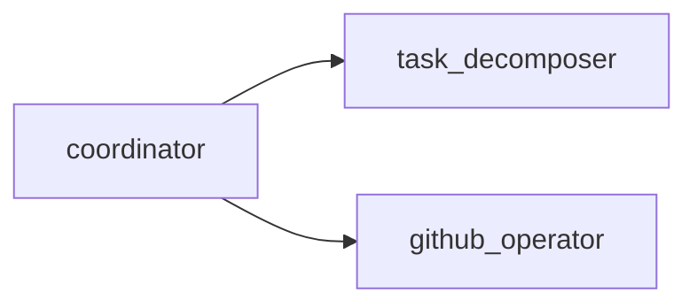

# Kanby

Your **conversational Kanban co-pilot** — paste meeting transcripts, homework docs, or research notes to generate an **explainable, ready-to-use Kanban board**.

✨ `Talk naturally → Get atomic tasks in GitHub Projects`  


[](https://google.github.io/adk-docs/)
[](LICENSE)

## Quickstart

1. Install [uv](https://docs.astral.sh/uv/getting-started/installation/)  

2. Clone & sync

    ```bash
    git clone https://github.com/timurci/kanby.git
    cd kanby
    uv sync
    ```
3. Configure your `GOOGLE_API_KEY`

    ```bash
    cp .env.example .env  # then edit .env
    ```
4. Launch in your preferred mode:

    ```bash
    uv run adk web          # Web chat interface (http://localhost:8000)
    uv run adk cli kanby    # Terminal chat interface
    ```

## Core Architecture (Phase 1)



## Contributing
Install hooks once you clone the repository,

```bash
uv sync
uv run pre-commit install
```

Pull requests are welcome.