# Kanby

Your **conversational Kanban co-pilot** — paste meeting transcripts, homework docs, or research notes to generate an **explainable, ready-to-use Kanban board**.

✨ `Talk naturally → Get atomic tasks in GitHub Projects`  


[](https://google.github.io/adk-docs/)
[](LICENSE)

## Quickstart

The recommended way to run Kanby is with Docker, which provides persistent sessions and a complete API interface.

### Docker Setup (Recommended)

1. Clone the repository

    ```bash
    git clone https://github.com/timurci/kanby.git
    cd kanby
    ```

2. Configure your credentials

    ```bash
    cp .env.example .env
    # Edit .env and add your GOOGLE_API_KEY and GITHUB_PERSONAL_ACCESS_TOKEN
    ```

3. Start the application

    ```bash
    make up
    ```

    This starts PostgreSQL and the FastAPI server with all services properly configured.

4. Access the API documentation at [localhost:8000/docs](http://localhost:8000/docs)

**Docker Commands:**
- `make up` - Start services (supports persistent sessions)
- `make down` - Stop services  
- `make logs` - Watch container logs
- `make restart` - Restart services

The docker setup supports persistent sessions, meaning you can stop and start the containers and continue where you left off.

**Note:** Currently the docker setup does not include a web interface service. Use the API endpoints or the development setup below for a more accessible interface.

### Development Setup (Alternative)

For local development without Docker:

1. Install [uv](https://docs.astral.sh/uv/getting-started/installation/)

2. Clone and install dependencies

    ```bash
    git clone https://github.com/timurci/kanby.git
    cd kanby
    make install
    ```

3. Configure your credentials

    ```bash
    cp .env.example .env
    # Edit .env and add your GOOGLE_API_KEY and GITHUB_PERSONAL_ACCESS_TOKEN
    ```

4. Launch in your preferred mode:

    ```bash
    make adk-web        # Web chat interface (http://localhost:8000)
    make adk-run        # Terminal chat interface
    ```

**Note:** Sessions are not persistent in the development setup.

## Core Architecture (Phase 2)

```mermaid
graph LR
    CO[💬 Coordinator]
    CO --> TP[💬 Task Planner]
    CO --> GO[💬 Github Operator]
    TP --> RV[🔧 Requirement Validator]
    TP --> TD[🔧 Decomposer]
    TP --> DM[🔧 Dependency Mapper]
    TP --> TR[🔧 Reviewer]

    GO --> GO_READONLY[🧰 GitHub MCP Read-only]
    GO --> GO_HITL[⚙️ HITL Confirmation]
    GO_HITL --> GO_WRITE[🧰 GitHub MCP Write]
```

