# Kanby - Conversational Kanban Co-pilot

Kanby reads meeting notes and automatically produces a dependency-aware project plan, then syncs it to GitHub Projects with human-in-the-loop (HITL) confirmation.

[](https://google.github.io/adk-docs/)
[](LICENSE)

## Overview

Teams frequently discuss work verbally but still need to manually rewrite those conversations into actionable tasks.
Kanby closes this gap by providing:

- A conversational interface that accepts transcripts, notes, or brainstorms
- Automated requirement validation and task decomposition
- Dependency mapping with quality checks (cycle detection, missing links, etc.)
- One-click GitHub issue and Project creation

Kanby produces a reviewable, dependency-aware project plan in minutes.

## 🧠 How It Works

Kanby uses a collection of specialized agents that cooperate through the Google ADK framework.

### High-Level Flow

1. **Input**: User provides meeting notes or an informal description.
2. **Requirement Validation**: The system asks clarifying questions if needed.

3. **Task Generation Pipeline**:
    - Decomposes the work
    - Maps hard/soft dependencies
    - Reviews the plan for completeness and failure modes
4. **Output**: A structured task graph ready for review.
5. **GitHub Sync** (optional): Creates and updates issues, GitHub Projects (HITL confirmed)

## Architecture Diagram

```mermaid
graph LR
    CO[💬 Coordinator]
    CO --> TP[💬 Task Planner]
    CO --> GO[💬 Github Operator]
    TP --> RV[🔧 Requirement Validator]
    subgraph TGP[Task Generator Pipeline]
        TD[🔧 Decomposer]
        TD --> DM[🔧 Dependency Mapper]
        DM --> TR[🔧 Reviewer]
    end
    TP --> TGP
    GO --> GO_READONLY[🧰 GitHub MCP Read-only]
    GO --> GO_HITL[⚙️ HITL Confirmation]
    GO_HITL --> GO_WRITE[🧰 GitHub MCP Write]
```


**Legend**
```
💬 LLM Agent (conversational)
🔧 AgentTool (non-conversational)
🧰 MCP Toolset
```

**Agent Flow**:
- **Coordinator**: Routes requests to planner or GitHub operator
- **Task Planner**: Orchestrates the 3-step workflow
  1. Validate requirements (or ask clarifying questions)
  2. Generate plan via pipeline (decompose → map dependencies → review)
  3. Present plan and offer GitHub sync
- **Task Generator Pipeline**: SequentialAgent running three sub-agents
  - **Decomposer**: Text → structured tasks
  - **Dependency Mapper**: Tasks → dependencies (hard/soft)
  - **Reviewer**: Validates plan quality (catches circular deps, missing links, etc.)
- **GitHub Operator**: Manages Projects/Issues, requires HITL confirmation for writes

## Quickstart

### Option 1: API via Docker
```bash
git clone https://github.com/timurci/kanby.git
cd kanby
cp .env.example .env    # Set GOOGLE_API_KEY and GITHUB_PERSONAL_ACCESS_TOKEN
make up                 # Starts Docker containers
```

Access API docs at `localhost:8000/docs`

### Option 2: ADK CLI

```bash
git clone https://github.com/timurci/kanby.git
cd kanby
make install
cp .env.example .env    # Set GOOGLE_API_KEY and GITHUB_PERSONAL_ACCESS_TOKEN
```

Then, launch either the web interface or the CLI:
- Web Interface: `make adk-web`
- Command Line: `make adk-run`

> **Note**: The ADK web interface currently has a known issue where it fails to send responses for HITL confirmation requests.

**Requirements**: Python 3.13+, uv package manager.

## Project Structure

```
kanby/
├── kanby/
│   ├── agent.py                          # Coordinator agent
│   ├── sub_agents/
│   │   ├── task_planner/                 # Conversational planning flow
│   │   ├── task_generator_pipeline/      # Decompose → map deps → review
│   │   │   └── sub_agents/
│   │   │       ├── task_decomposer/
│   │   │       ├── task_dependency_mapper/
│   │   │       └── task_reviewer/
│   │   ├── github_operator/              # GitHub MCP integration
│   │   └── task_requirement_validator/
│   └── plugins/logging.py                # Custom callbacks for monitoring
├── evals/                                # Evalset for requirement validator
└── api/                                  # FastAPI service
```